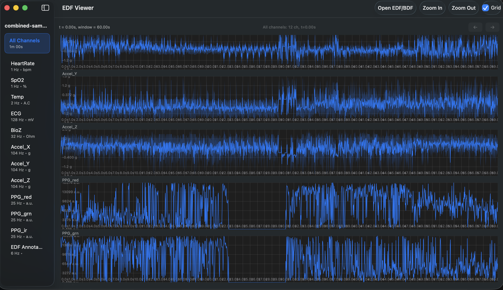
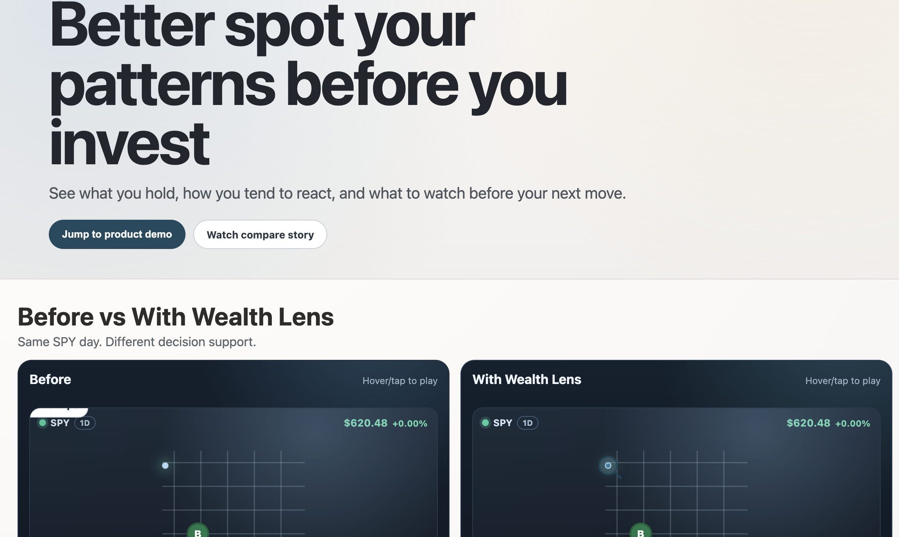

# Victor, Mobile Engineer | Build Pipelines from Devices to Cloud👋

I specialize in creating Mobile Apps (SwiftUI / React Native) and data pipelines from dashboard to Cloud (React.js，FastAPI & Node.js).

>  *"Whatever you do, work at it with all your heart, as working for the LORD, not for human masters."*
— Colossians 3:23

## Featured Project

- [**Wealth Lens**](https://yourlens.vercel.app/): A web-based risk engine for investors that helps users understand Behavior x Market Context before making the next move. Inspired by my family, it supports beginner investors with clearer options literacy and risk awareness.
- [**EDFViewerLite-MacOS**](https://github.com/zywkloo/EDFViewerLite-MacOS): An open-source, native macOS app built with SwiftUI to open and inspect EDF/BDF biomedical signals. It fills a clear market gap for a truly native Mac EDF inspector.

<table>
  <tr>
    <td align="center">
      
    </td>
    <td align="center">
      
    </td>
  </tr>
  <tr>
    <td align="center">
      <a href="https://github.com/zywkloo/EDFViewerLite-MacOS"><strong>EDFViewerLite-MacOS</strong></a>
    </td>
    <td align="center">
      <a href="https://yourlens.vercel.app/"><strong>Wealth Lens</strong></a>
    </td>
  </tr>
</table>

<!-- 

  

 -->

## About Me

- 💻 **Development**: 6 years in mobile development, 4 years in full-stack data processing.
- 🎮 **Game Design**: As the design lead, achieving No.1 in Sports and No.9 in Games in China's App Store on [May 3, 2015](https://www.linkedin.com/in/yiweiz315/overlay/1605156128130/single-media-viewer?profileId=ACoAAAiuV8IBlPS-3MR67sLJM3hfVdSAEgwG3ZY).
- 🌱 **Hackathons**: Team lead of CuHacking 2019 & 2020 winners ([InGenius / Martello Sponsor Awards](https://devpost.com/zywkloo)).
- ⌨️ **Blogging**: Read my tech thoughts on my [Personal Blog](https://zywkloo.github.io/).
- 📺 **Streaming**: Live Coding Streamer on [twitch.tv/zywkloo](https://www.twitch.tv/zywkloo), streaming LeetCode contests and gaming weekly.

  
🎓 Degrees

  
  - 📖 Master of Data Science, UBC, Vancouver, Canada
  - 🍁 B.Sc. in Computer Science, Carleton University, Ottawa, Canada
  - 🏙️ B.Eng. in Urban Planning, Peking University, Beijing, China
  - 🥇 Carleton University Medal in Computer Science, 2020 Fall

  
✍🏻 Recent Posts

  
  - 🛠️ [Worktree Refactor Playbook](https://zywkloo.github.io/blog/worktree-refactor-playbook/)
  - 🏙️ [Choosing the Right JavaScript Data Visualization Framework: Insights and Comparisons](https://zywkloo.medium.com/choosing-the-right-javascript-data-visualization-framework-insights-and-comparisons-6325b8d66969)
  - ⚛️ [3 Lessons Taught w/ React-Part 1:State Updates](https://zywkloo.medium.com/lessons-learned-to-improve-react-performance-b722c9b992e6)
  - ⚛️ [React-Native-Meteor: FB/Google Login & OAuth](https://zywkloo.github.io/React-Native-Meteor-SocialLogin/)
  - 🎲 [Board Game A.I.: from Deep Blue to Alpha Go](https://zywkloo.medium.com/board-game-a-i-from-deep-blue-to-alpha-go-4dffb5276064)

<!-- 

  
 🏛️ Stats About Me 

  
  

 -->

## Connect with Me

  <!-- LinkedIn -->
  
  <!-- Devpost -->
  
  <!-- Personal Blog -->
  
  <!-- Medium -->
  
    <!-- Twitch -->
  

